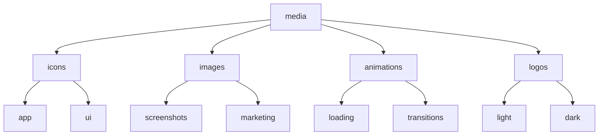

# 🎨 Media Directory

<div align="center">


*Repository for all SpeakEasy visual and media assets*

[]()
[]()
[]()

</div>

---

## 📁 Directory Structure



## 🎯 Quick Links

| Category | Description | Status |
|----------|-------------|---------|
| [📱 Icons](#icons) | Application and UI icons | ✅ Active |
| [🖼️ Images](#images) | Static images and graphics | ✅ Active |
| [✨ Animations](#animations) | Motion graphics and effects | ✅ Active |
| [🎨 Logos](#logos) | Branding and identity | ✅ Active |

## 📋 File Types

<div align="center">

| Format | Use Case | Size Limit | Optimization |
|--------|----------|------------|--------------|
| `.svg` | Vector graphics | < 100KB | SVGO |
| `.png` | Raster images | < 500KB | TinyPNG |
| `.gif` | Simple animations | < 1MB | Gifsicle |
| `.webp`| Web optimized | < 250KB | cwebp |

</div>

## 🏷️ Naming Convention

```
category-name-size-variant.extension
```

**Examples:**
```
✅ logo-dark-128px.svg
✅ icon-settings-32px-outlined.png
✅ animation-loading-light.gif
```

## 📑 Asset Categories

### 📱 Icons
> Application and interface icons

<div align="center">

| Type | Sizes | Formats |
|------|--------|----------|
| App Icons | 16, 32, 64, 128, 256, 512 | SVG, PNG |
| UI Elements | 16, 24, 32 | SVG |
| System Tray | 16, 32 | PNG |

</div>

### 🖼️ Images
> Static graphics and screenshots

<div align="center">

| Type | Resolution | Format |
|------|------------|---------|
| Screenshots | 1920x1080 | PNG, WebP |
| Marketing | Various | PNG, WebP |
| Backgrounds | Various | SVG, WebP |

</div>

### ✨ Animations
> Motion graphics and effects

<div align="center">

| Type | Duration | Format |
|------|----------|---------|
| Loading | 1-2s | GIF, WebP |
| Transitions | < 1s | GIF, WebP |
| Tutorials | Various | WebP |

</div>

### 🎨 Logos
> Brand identity assets

<div align="center">

| Variant | Formats | Background |
|---------|---------|------------|
| Primary | SVG, PNG | Light/Dark |
| Symbol | SVG, PNG | Light/Dark |
| Wordmark | SVG, PNG | Light/Dark |

</div>

## 💡 Usage Guidelines

<details>
<summary><b>Best Practices</b></summary>

- ✅ Always optimize assets before committing
- ✅ Maintain aspect ratios when resizing
- ✅ Use vector formats when possible
- ✅ Include source files for complex assets
- ❌ Don't commit unoptimized files
- ❌ Don't use non-standard dimensions
</details>

<details>
<summary><b>Optimization Tools</b></summary>

- 🔧 SVGO for SVG optimization
- 🔧 TinyPNG for PNG compression
- 🔧 Gifsicle for GIF optimization
- 🔧 WebP converter for WebP generation
</details>

## 📞 Contact & Support

<div align="center">

Need help with media assets? Contact us:

[]()
[]()
[]()

</div>

---

<div align="center">

**SpeakEasy Media Directory** | Made with 💙 by the SpeakEasy Team

</div>
